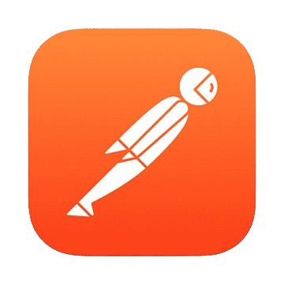

## Hi 👋 My name is Andrey Bobb.

- I’m currently learning AQA engineer

## Contact me
For direct communication, please use 

#### 🛠️ Tech Stack:

<code></code>
<code></code>
<code></code>
<code></code>
<code></code>
<code></code>
<code></code>
<code></code>
<code></code>
<code></code>

